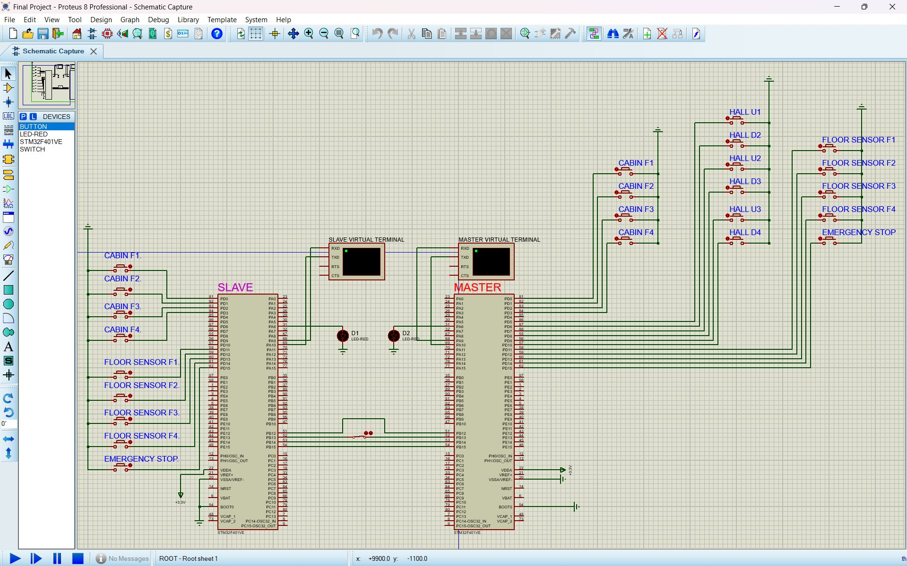

# STM32F401VE Collaborative Dual-Elevator System over SPI IPC

Two STM32F401VE boards built from one codebase, communicating over SPI to coordinate a 4-floor elevator system. The Master board runs Elevator A and dispatches hall calls; the Slave board runs Elevator B and follows commands while maintaining autonomous fallback capability.

## Proteus simulation



The schematic shows both STM32F401VE boards side by side. The Slave (left) and Master (right) share SPI2 lines (PB12–PB15) connected at the centre. Each board has its own Virtual Terminal for UART telemetry output. Cabin buttons (F1–F4), floor sensors (F1–F4), hall call buttons (U1/D2/U2/D3/U3/D4), and the Emergency Stop switch are wired to Port D. The two red LEDs (D1, D2) on PA6 reflect PWM motor duty via TIM3 CH1.

## Repository structure

| File | Purpose |
|---|---|
| `App.h` | Public `App_Init` / `App_Run` interface |
| `App_Common.c` | Shared init, scheduler, ISR callbacks, `App_Init`, `App_Run` |
| `App_Internal.h` | Internal shared state, timing constants, role interface |
| `App_Master.c` | Master role: hall-call dispatch, scoring, SPI master |
| `App_Slave.c` | Slave role: command reception, independent-mode fallback |
| `Elevator.h/.c` | Elevator FSM (idle → moving → doors open → idle) |
| `Protocol.h/.c` | 8-byte SPI frame builder and parser with XOR checksum |

## Build

Set the Arm toolchain path in `cmake/ArmToolchain.cmake`, then:

```bash
cmake -S . -B build-master -GNinja -DELEVATOR_ROLE=MASTER
cmake --build build-master

cmake -S . -B build-slave  -GNinja -DELEVATOR_ROLE=SLAVE
cmake --build build-slave
```

Load in Proteus:

```
build-master/dual-elevator-spi.hex  →  Master STM32F401VE
build-slave/dual-elevator-spi.hex   →  Slave  STM32F401VE
```

## Pin map

| Function | Master | Slave |
|---|---|---|
| PWM motor / LED (TIM3 CH1) | PA6 | PA6 |
| UART1 TX | PA9 | PA9 |
| UART1 RX | PA10 | PA10 |
| SPI2 NSS | PB12 (output, SW-driven) | PB12 (hardware NSS input) |
| SPI2 SCK | PB13 | PB13 |
| SPI2 MISO | PB14 | PB14 |
| SPI2 MOSI | PB15 | PB15 |
| Cabin buttons F1–F4 | PD0–PD3 | PD0–PD3 |
| Floor sensors F1–F4 | PD11–PD14 | PD11–PD14 |
| Emergency button | PD15 | PD15 |
| Hall calls U1,D2,U2,D3,U3,D4 | PD5–PD10 | — |
| Common ground | VSS/GND | VSS/GND |

All button/sensor inputs use internal pull-ups and falling-edge EXTI interrupts.

## Timing constants

| Item | Period |
|---|---:|
| SysTick / scheduler base | 1 ms |
| FSM tick (`Elevator_FsmStep`) | 10 ms |
| SPI state exchange | 25 ms |
| UART telemetry | 200 ms |
| Comm-fault timeout | 200 ms |
| Floor travel simulation | 400 ms per floor |
| Door open time | 600 ms |

## Elevator FSM

```
IDLE ──(target added)──► MOVING_UP / MOVING_DOWN
                               │
                  (floor reached, timer ≥ 400 ms)
                               │
                         DOORS_OPEN  (600 ms)
                               │
                          back to IDLE

Any state ──(emergency toggle)──► EMERGENCY
EMERGENCY ──(second toggle)──► IDLE
```

PWM duty is set to 100 % while travelling more than one floor away, 20 % on the final approach floor, and 0 % when stopped or in emergency.

## SPI packet format (8 bytes)

| Byte | Field | Notes |
|---|---|---|
| 0 | Header | `0xA5` |
| 1 | Seq | Rolling counter |
| 2 | State | `ElevatorStateType` enum value |
| 3 | Current floor | 1–4 |
| 4 | Target mask | Bit *n-1* set = floor *n* queued |
| 5 | Flags | See flag bits below |
| 6 | Cmd mask | Master→Slave floor assignment mask |
| 7 | Checksum | XOR of bytes 0–6 |

**Flag bits (byte 5)**

| Bit | Constant | Meaning |
|---|---|---|
| 0 | `IPC_FLAG_EMERGENCY` | Sender is in emergency |
| 1 | `IPC_FLAG_COMM_FAULT` | Master lost contact with Slave |
| 2 | `IPC_FLAG_DIR_UP` | Sender moving up |
| 3 | `IPC_FLAG_DIR_DOWN` | Sender moving down |
| 4 | `IPC_FLAG_INDEPENDENT` | Slave running without Master |

## Dispatch algorithm (Master)

For each pending hall call the Master scores both elevators and assigns the call to whichever scores lower:

```
score = 0    if idle and already on the floor
score = 10 + distance   if moving in the call's direction and can pick it up en-route
score = 40 + distance   if idle but not on the floor
score = 45 + distance   if doors open on the floor
score = 70 + distance   if moving in the right direction but the call is behind
score = 200             if moving in the wrong direction
score = 1000            if in emergency
```

Calls with both scores ≥ 200 are deferred until one elevator becomes eligible. If the Slave comm link has faulted all hall calls go directly to Elevator A.

## Fault tolerance

- **Comm fault (Master side):** if no valid SPI frame is received from the Slave within 200 ms (`COMM_TIMEOUT_MS`), `IsSlaveCommFault()` returns true. All new hall calls are assigned to Elevator A and the `IPC_FLAG_COMM_FAULT` bit is set in outgoing frames. A stalled master SPI transaction is aborted and retried on the next 25 ms period.
- **Independent mode (Slave side):** if the Slave receives no valid frame for 200 ms it sets `IndependentMode = 1`, reports `IPC_FLAG_INDEPENDENT`, and continues serving its own cabin buttons autonomously. It returns to linked mode as soon as a valid master frame arrives.

## Non-blocking design

The main loop (`App_Run`) never busy-waits. All timing is driven by SysTick flags (`Flag_FsmStep`, `Flag_SpiPeriod`, `Flag_Telemetry`) that are set in the 1 ms ISR and consumed once in the loop. SPI transfers are started with a callback (`Spi_DoneCallback`) and the result is processed on the next `Flag_SpiDone` check. The only polling path is UART transmit, which is used only for debug telemetry.

## UART telemetry format

**Master** (every 200 ms):
```
M A:F<floor> S:<state> T:0x<target_mask> H:0x<hall_pending> B:F<slave_floor> <slave_state> Comm:OK|FAULT
```

**Slave** (every 200 ms):
```
S B:F<floor> S:<state> T:0x<target_mask> Mode:LINK|INDEP
```

## Additional documentation

| File | Contents |
|---|---|
| `PROTEUS_GUIDE.md` | Wiring diagram and Proteus component configuration |
| `PACKET_DEFINITION.md` | Annotated 8-byte SPI frame diagram |
| `LAB_PREP.md` | Register map, PWM math, allocation algorithm notes |
| `NON_BLOCKING_REVIEW.md` | Justification for no-busy-wait compliance |
| `TEST_CASES.md` | Demo test sequences and expected UART output |